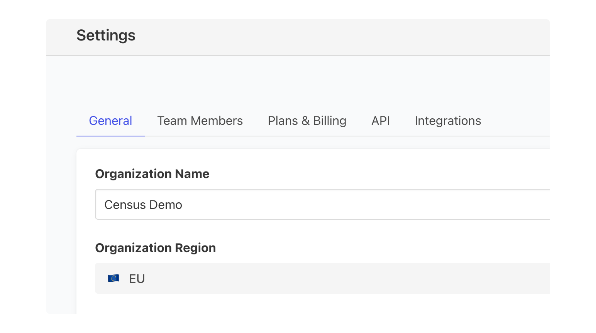

# Regions & IP Addresses

## Regions

#### Intro

Census runs data syncs using Amazon Web Services in the **United States (us-east-1)** and **European Union (eu-central-1)** regions. Census never stores your data, but your selected region determines where data is processed during your Census syncs.


By default, Census will run services with US-based infrastructure. Customers who have purchased the Census Core or Platform Plans may request to use another region by contacting [support@getcensus.com](mailto:support@getcensus.com).


#### Supported Regions

| Geography           | AWS Regions              |
| ------------------- | ------------------------ |
| 🇺🇸 United States  | us-east-1 (N. Virginia)  |
| 🇪🇺 European Union | eu-central-1 (Frankfurt) |

#### Setting up

To view your workspace's current region, navigate to the [Settings > General page](https://app.getcensus.com/settings/general) in your Census account. You will find your region identified under **"Organization region"**.

If your data source or self-hosted destinations are behind a firewall, you will need to allowlist [Census's IP Addresses](census-ip-addresses.md) associated with your region.

Customers who have purchased the Census Platform Plan may request to use another region by contacting [support@getcensus.com](mailto:support@getcensus.com).

#### During Syncs

Census never stores your customer data, but during a sync, data will flow temporarily through Census servers. A Census sync goes through 4 steps to sync data from your source to your destination:

1. Identifying Changes in your Data Source
2. Unloading Changes to Cloud Storage
3. Preparing Data and Loading into your Destination
4. Reporting Skipped Records and Feedback to your Data Source

Census will perform steps 2 and 3 using infrastructure in the region you've specified. For customers in need of finer-grained security, you may also [provide your own S3 or GCS bucket](configuring-census-to-use-an-s3-bucket-you-control.md) where Census will unload the changed records (the "diffs") for each sync. The diagram below showcases which steps in the Census sync process occur in the region of your choice.

<figure><figcaption></figcaption></figure>


If your organization has strict data residency requirements, we recommend verifying that your source and destination both store and process data in your desired region. Census will interact with the source and destination using region-specific resources but cannot guarantee that your sources and destinations also operate in the same region.


## IP Addresses

Census syncs data from your data sources to your destinations using a set of static IP addresses. To ensure that Census can connect successfully to your sources or any self-hosted destinations, you must allowlist the following IP addresses in your firewall.&#x20;

| Region                                                                                       | IP Addresses (CIDR)                                                                             |
| -------------------------------------------------------------------------------------------- | ----------------------------------------------------------------------------------------------- |
| 🇺🇸 N. Virginia (us-east-1)                                                                 | 
<code>3.220.140.57</code>

<code>54.81.195.173</code>
                               |
| 
🇺🇸 Oregon (us-west-2) <strong>Legacy IPs to be deprecated in April 2023</strong>
 | 
<code>34.216.163.241</code>

<code>54.212.243.205</code>
                            |
| 🇪🇺 Frankfurt (eu-central-1)                                                                | 
<code>3.73.223.175</code>

<code>18.195.84.64</code>

<code>3.74.27.151</code>
 |

