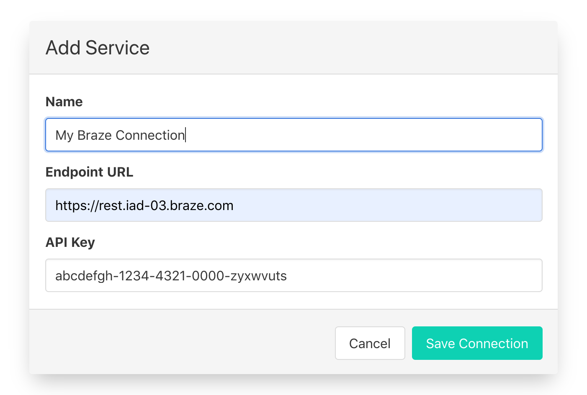

# Braze

### Note on Braze API Costs


Braze prices its API on a per datapoint update basis. Census ensures that only fields that need to be updated are sent (rather than a copy of the entire record). Please be aware that large datasets, which change often can increase your Braze API usage.&#x20;


## 🏃‍♀️ Getting Started

In this guide, we will show you how to connect Braze to Census and create your first sync.



### Prerequisites

* Have your Census account ready. If you need one, [create a Free Trial Census account](https://app.getcensus.com/) now.
* Have your Braze account ready, with create access for Braze API keys.
* Have the proper credentials to access to your data source. See our docs for each supported data source for further information:
  * [Databricks](https://docs.getcensus.com/sources/databricks)
  * [Elasticsearch](https://docs.getcensus.com/sources/elasticsearch)
  * [Google BigQuery](https://docs.getcensus.com/sources/google-bigquery)
  * [Google Sheets](https://docs.getcensus.com/sources/google-sheets)
  * [MySQL](https://docs.getcensus.com/sources/mysql)
  * [Postgres](https://docs.getcensus.com/sources/postgres)
  * [Redshift](https://docs.getcensus.com/sources/redshift)
  * [Rockset](https://docs.getcensus.com/sources/rockset)
  * [Snowflake](https://docs.getcensus.com/sources/snowflake)
  * [SQL Server](https://docs.getcensus.com/sources/sql-server)

### 1. Create a Braze API key

Braze lets you create a number of API keys, each with their own set of permissions. You'll almost certainly want to create a new API key for Census rather than reusing an existing one.

Within Braze's left navigation bar, scroll down to the very bottom. Under **App Settings** and click **Developer Console**.

Then, inside the **API Settings** tab, under **Rest API Keys**, click **+ Create New API Key**.

Provide a name you'll recognize ("Census" is a good choice) and select the following permissions:

* All User Data permissions, except for `users.delete`&#x20;
* `segments.list`
* This permission set may change as we add support for more Braze objects so you may want to grant more permissions now or plan to update these permissions in the future.&#x20;

Scroll down and click **Save API Key**.

Finally, copy the long code you see under **Identifier**. We'll use that in a minute.

### 2. Select your Braze API Endpoint

Braze requires that we use a slightly different URL to access your account depending on where it's been set up. See the [full list of all Braze API Endpoints](https://www.braze.com/docs/api/basics/#endpoints). In general, you just need the number from the URL you see in your browser when you're signed into Braze.\
\
For example, if your Braze URL is https://dashboard-**03**.braze.com/, then your API Endpoint should be https://rest.iad-**03**.braze.com.

### 3. Create the Census Connection

Great! Now let's pull it all together.&#x20;

1. In the **Settings** tab, Create a new Braze Service Connection in Census.\
   &#x20;&#x20;
2. You can provide whatever name you like.
3. Provide the appropriate Braze Endpoint URL.
4.  Copy and paste your new Braze API key.\

    

And you're all set and ready to get syncing! 🎉

## 🗄 Supported Objects

Census currently supports syncing to the following Braze objects.

| **Object Name** | **Supported?** | Identifiers      |
| --------------: | :------------: | ---------------- |
|            User |        ✅       | External User ID |
|           Event |        ✅       | Event ID         |

Census supports custom fields on both Braze User and Event objects. Additionally, Census supports [sending structured data](../basics/defining-source-data/structured-data.md) to Braze:&#x20;

* [User Push Tokens](https://www.braze.com/docs/api/objects\_filters/user\_attributes\_object#push-token-import) - To send push tokens, your data should be structured as an array of objects with 2-3 values: `app_id`, `token`, and an optional `device_id`.
* &#x20;[Nested Custom Attributes](https://www.braze.com/docs/user\_guide/data\_and\_analytics/custom\_data/custom\_attributes/nested\_custom\_attribute\_support/#api-request-body) - Both objects and arrays are supported. As of April 2022, this feature is still in early access. You may need to contact your Braze account manager for access.

[Contact us](mailto:support@getcensus.com) if you want Census to support more objects for Braze.

## 🔄 Supported Sync Behaviors


Learn more about all of our sync behaviors on our [Core Concepts page](../basics/core-concept/#the-different-sync-behaviors).


|        **Behaviors** |                       **Supported?**                      | **Objects?** |
| -------------------: | :-------------------------------------------------------: | :----------: |
| **Update or Create** | [✅](https://docs.getcensus.com/basics/alerts#sync-alerts) |     User     |
|           **Mirror** |                             ✅                             |     User     |
|           **Append** |                             ✅                             |     Event    |

Braze's Mirror behavior optionally supports a choice of two actions when a records is removed from the source. This can be configured when setting up the sync initially:

* **Delete record** - This is the typical behavior for most mirror syncs. When a record is removed from the source, the corresponding record will be deleted from Braze.&#x20;
* **Null out fields** - This is a new behavior for mirror syncs in Braze. In this case, when a record is removed from the source, the currently mapped fields of the synced will be removed from the destination record (by setting them to Null).

[Contact us](mailto:support@getcensus.com) if you want Census to support more sync behaviors for Braze.

## 🚑 Need help connecting to Braze?

[Contact us](mailto:support@getcensus.com) via support@getcensus.com or start a conversation with us via the [in-app](https://app.getcensus.com) chat.
