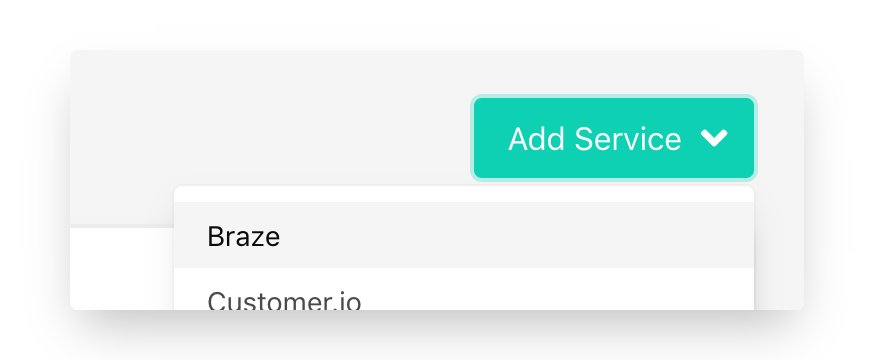

# Braze

## 🏃‍♂️ Getting Started

In this guide, we'll show you how to connect Census to Braze. 



### **Prerequisites**

To set up your first Braze sync, you'll need three things:

* A Census Account – If you don't have one already, [create a Free Trial Census Account](https://app.getcensus.com/).
* Access to your data warehouse. For details on how to create credentials, see our articles for [Redshift](../source-warehouse/redshift.md), [Snowflake](../source-warehouse/snowflake.md), [Google BigQuery](../source-warehouse/google-bigquery.md), [Databricks](../source-warehouse/databricks.md), and [Postgres](../source-warehouse/postgres.md).
* A Braze account with access to create a Braze API Key. 

### 1. Create a Braze API key

Braze lets you create a number of API keys, each with their own set of permissions. You'll almost certainly want to create a new API key for Census rather than reusing an existing one.

Within Braze's left navigation bar, scroll down to the very bottom. Under **App Settings** and click **Developer Console**.

Then, inside the **API Settings** tab, under **Rest API Keys**, click **+ Create New API Key**.

Provide a name you'll recognize \("Census" is a good choice\) and select the following permissions:

* All User Data permissions, except for `users.delete` 
* `segments.list`
* This permission set may change as we add support for more Braze objects so you may want to grant more permissions now or plan to update these permissions in the future. 

Scroll down and click **Save API Key**.

Finally, copy the long code you see under **Identifier**. We'll use that in a minute.

### 2. Select your Braze API Endpoint

Braze requires that we use a slightly different URL to access your account depending on where it's been set up. See the [full list of all Braze API Endpoints](https://www.braze.com/docs/api/basics/#endpoints). In general, you just need the number from the URL you see in your browser when you're signed into Braze.  
  
For example, if your Braze URL is https://dashboard-**03**.braze.com/, then your API Endpoint should be https://rest.iad-**03**.braze.com.

### 3. Create the Census Connection

Great! Now let's pull it all together. 

1. In the **Settings** tab, Create a new Braze Service Connection in Census.   
2. You can provide whatever name you like.
3. Provide the appropriate Braze Endpoint URL.
4. Copy and paste your new Braze API key.  

   

And you're all set and ready to get syncing! 🎉

## 🗄 Supported Objects

Census currently supports syncing to the following Braze objects.

| **Object Name** | **Supported?** | Identifiers |
| ---: | :---: | :--- |
| User | ✅ | External User ID |
| Events | 🔜 |  |

[Contact us](mailto:support@getcensus.com) if you want Census to support more objects for Braze.

## 🔄 Supported Sync Behaviors


Learn more about all of our sync behaviors on our [Core Concepts page](../basics/core-concept.md#the-different-sync-behaviors).


| **Behaviors** | **Supported?** | **Objects?** |
| ---: | :---: | :---: |
| **Update or Create** | ✅ | User |

[Contact us](mailto:support@getcensus.com) if you want Census to support more Sync Behaviors for Braze.

## 🚑 Need help connecting to Braze?

Contact us via support@getcensus.com or start a conversion via the [in-app](https://app.getcensus.com) chat.

