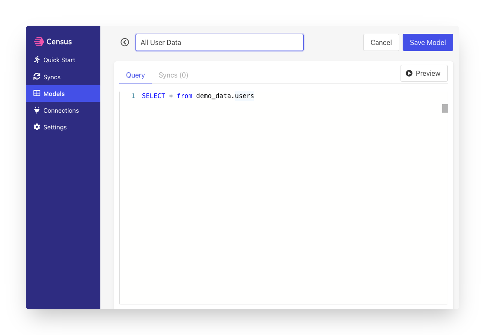

# CampaignMonitor

## 🏃‍♀️ Getting Started

‌In this guide, we will show you how to connect CampaignMonitor to Census and create your first sync.

### Prerequisites

* Have your Census account ready. If you need one, [create a Free Trial Census account](https://app.getcensus.com) now.
* Have your CampaignMonitor account ready.
*   Have the proper credentials to access to your data source. See our docs for each supported data source for further information:

    * [Databricks](https://docs.getcensus.com/sources/databricks)
    * [Google BigQuery](https://docs.getcensus.com/sources/google-bigquery)
    * [Google Sheets](https://docs.getcensus.com/sources/google-sheets)
    * [Postgres](https://docs.getcensus.com/sources/postgres)
    * [Redshift](https://docs.getcensus.com/sources/redshift)
    * [Rockset](https://docs.getcensus.com/sources/rockset)
    * [Snowflake](https://docs.getcensus.com/sources/snowflake)

### 1. Get CampaignMonitor API Key

1. Within CampaignMonitor, visit **Settings** then **Developer** page.
2. Copy the API key to provide to Census

### 2. Connect CampaignMonitor

* Once you are in Census, Navigate to [Connections](https://app.getcensus.com/connections)
* Click the **Add Service** button
* Select CampaignMonitor in the dropdown list

* When prompted for your API Credentials, enter your CampaignMonitor API Key

Once complete, you'll see your new connection in the **Service Connections** list. :point\_down:

### 3.  Connect to your Data Warehouse

Please follow one of our short guides depending on your data warehouse technology

* [Redshift](https://help.getcensus.com/article/10-configuring-redshift-postgresql-access)
* [Postgres](https://help.getcensus.com/article/10-configuring-redshift-postgresql-access) &#x20;
* [BigQuery](https://help.getcensus.com/article/21-configuring-bigquery-access)
* [Snowflake](https://help.getcensus.com/article/8-configuring-snowflake-access)

### 4. Create your first model

Now navigate to the **Model section of our Dashboard**

When defining models, you'll write SQL queries to select the data you want to see in CampaignMonitor. This can be as simple as selecting everything in a specific database table or as complex as creating new calculated values.

1. From inside your Census account, navigate to the **Models** page.
2. Enter a name for your model. You'll use this to select the model later.
3. Enter your SQL query. If you want to test the query, use the **Preview** button.
4. Click **Save Model**.

### 5. Create your first Sync

The sync will move data from your warehouse to CampaignMonitor. In this step, you'll define how that will work.

1. From inside your Census account, navigate to the [Syncs](https://app.getcensus.com/syncs) page.
2. Under **What data do you want to sync?**, choose your data warehouse as the **Connection** and your model as the **Source**.
3. Under **Where do you want to sync data to?**, choose CampaignMonitor as the **Connection** and the **Subscribe Object** in CampaignMonitor. (See Supported Objects.)
4. Under **How should changes to the source be synced?**, choose **Update or Create**. (See Supported Sync Behaviors.)
5. &#x20;Under **How are source and destination records matched?**, select a mapping key. (See Supported Objects for details.)&#x20;
6. &#x20;Under **Which Properties should be updated?**, select the fields you want to update by mapping a field in CampaignMonitor to a column in your model.
7. Click **Next**. This will open the **Confirm Details** page where you can see a recap of your setup.
8. If you want to start a sync immediately, select the **Run a sync now?** checkbox.
9. Click **Create Sync**.

When configuring your sync, the page should look something like this: 👇

### Step 6: Confirm the synced data in CampaignMonitor

Once your sync is complete, it's time to check your data. Open CampaignMonitor and check that the records updated correctly.&#x20;

If everything went well, that's it! You've started syncing data from your warehouse to CampaignMonitor!&#x20;

And if anything went wrong, [contact the Census support team](mailto:support@getcensus.com) to get some help.

## 🗄 Supported Objects

Census currently supports syncing to the following CampaignMonitor objects.

|             |            |               |
| :---------: | :--------: | :-----------: |
| Object Name | Supported? |  Identifiers  |
|  Subscriber |      ✅     | Email Address |

[Contact us](mailto:support@getcensus.com) if you want Census to support more objects for CampaignMonitor.

## 🔄 Supported Sync Behaviors


Learn more about all of our sync behaviors on our [Core Concepts page](../basics/core-concept/#the-different-sync-behaviors).


|                      |                      |            |
| :------------------: | :------------------: | :--------: |
|       Behaviors      |      Supported?      |   Objects  |
| **Update or Create** | :white\_check\_mark: | Subscriber |

[Contact us](mailto:support@getcensus.com) if you want Census to support more Sync Behaviors for CampaignMonitor.

## 🚑 Need help connecting to CampaignMonitor?

[Contact us](mailto:support@getcensus.com) via support@getcensus.com or start a conversation with us via the [in-app](https://app.getcensus.com) chat.
