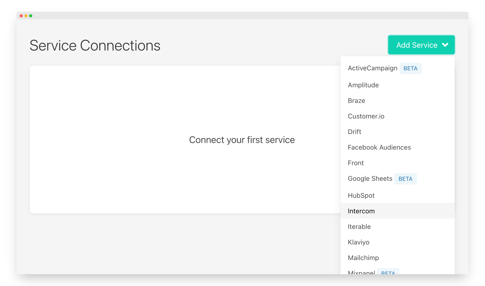
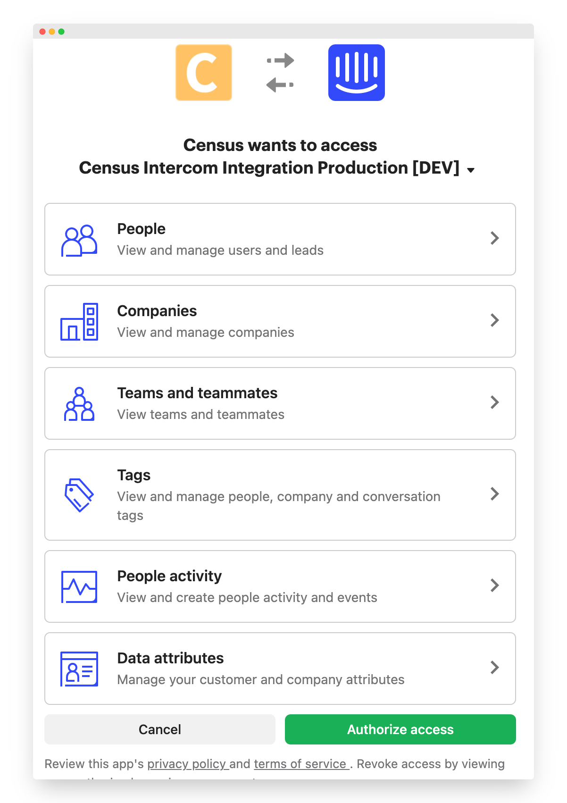
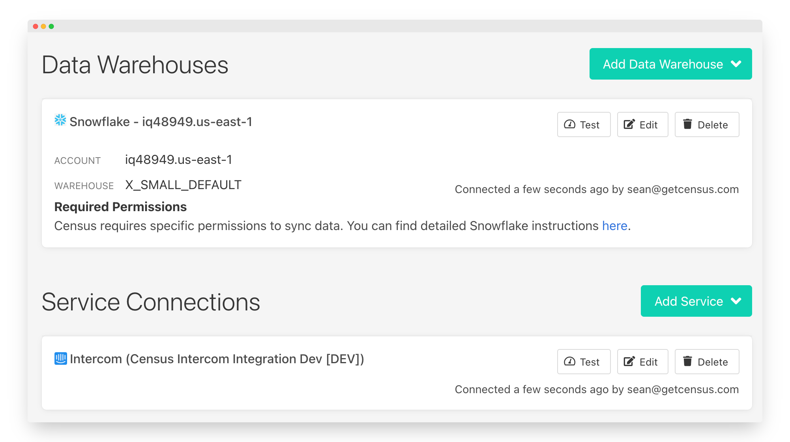
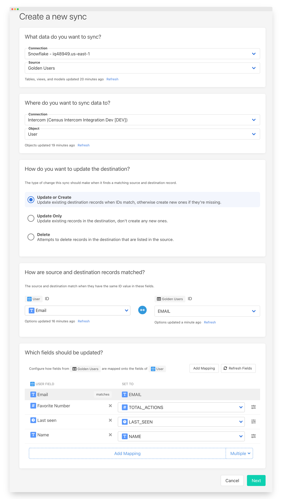
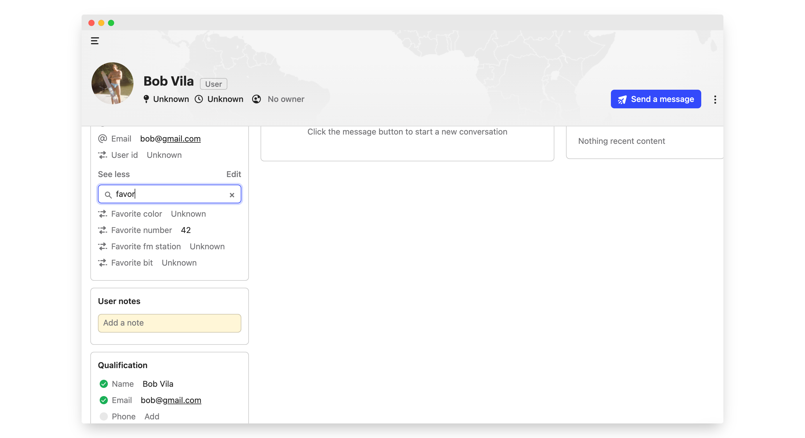

# Intercom

## 🏃‍♂️ Getting Started

In this guide, we will show you how to connect your Intercom instance to [Census](https://www.getcensus.com/) and create your first sync.



### **Prerequisites**

* [Create a Free Trial Census Account](https://app.getcensus.com/)
* Have your Intercom account ready
* Have the credential to access your warehouse. See our articles for each data warehouse
  * [Redshift](../source-warehouse/redshift.md)
  * [Snowflake](../source-warehouse/snowflake.md)
  * [Google BigQuery](../source-warehouse/google-bigquery.md)
  * [Databricks](../source-warehouse/databricks.md)
  * [Postgres](../source-warehouse/postgres.md)

### 1. Connect Intercom

* Once you are in Census, Navigate to [Connections](https://app.getcensus.com/connections)
* Click the **Add Service** button
* Select **Intercom** in the dropdown list

You'll see an Intercom OAuth screen describing the permissions Census needs. Note that if your account has access to multiple Intercom workspaces, you'll also have the option to select the specific workspace.

### 2. Connect your Data Warehouse

Please follow one of our short guides depending on your data warehouse technology

* [Redshift](https://help.getcensus.com/article/10-configuring-redshift-postgresql-access)
* [Postgres](https://help.getcensus.com/article/10-configuring-redshift-postgresql-access)
* [BigQuery](https://help.getcensus.com/article/21-configuring-bigquery-access)
* [Snowflake](https://help.getcensus.com/article/8-configuring-snowflake-access)

After setting up your warehouse, your Census Connections Page should look like this

### 3. Create your first Model

Now navigate to the [Model section of our Dashboard](https://app.getcensus.com/models)

Here you will have to write SQL queries to select the data you want to see in Intercom. Here are some ideas of data you should select

* The Lifetime Value of a customer and add it to a contact or companies
* The end of their trial
* The date they became active in your product
* The number of key activities a user did in your app in the last 7/30 days

Once you have created your model, click save. 

### 4. Create your first Sync

Now head to the [Sync page](https://app.getcensus.com/syncs) and click the **Add Sync** button

In the " **What data do you want to sync?"** section

* For the **Connection**, select the data warehouse you connected in step 2
* For the **Source,**  select the model you created in step 3

Next up is the **"Where do you want to sync data to?"** section

* Pick Intercom as **the Connection**
* For Object, pick the one you want to sync data to.

For the " **How should changes to the source be synced?"** section 

* Select your preferred behavior. **Update only** is a great place to start!
* Pick the right mapping key, it could be Email for Contacts, Company ID for Companies but we recommend you use your own database id if possible

Finally, select the fields you want to update in the Mapper in the **"Which Fields should be updated?"** section

* Here simply map the field from your Intercom instance to the column from your model.

The end result should look something like this

Click the **Next** button to see the final preview which will have a recap of what will happen when you start the sync

### 5. Confirm the data is in Intercom

Now go back to your Intercom and go view a record type \(Contact or Company\) that should have been updated. If everything went well, you should see your data in Intercom

That's it! In 5 steps, you've connected Intercom and started syncing customer & product data from your warehouse  🎉

## 🗄 Supported Objects

Census currently supports syncing to the following Intercom objects.

| **Object Name** | **Supported?** | Identifiers |
| ---: | :---: | :--- |
| Company | ✅ | Company ID |
| Contact \(Lead or User\)  | ✅ | Email, Intercom ID, External ID |
| Lead | ✅ | Email, Intercom ID, External ID |
| User | ✅ | Email, Intercom ID, External ID |


If you're finding Companies missing in Intercom after a sync, make sure the company also has users associated with them. By default, Intercom hides companies with no associated users.


[Contact us](mailto:support@getcensus.com) if you want Census to support more objects for Intercom.

## 🔄 Supported Sync Behaviors


Learn more about all of our sync behaviors on our [Core Concepts page](../basics/core-concept.md#the-different-sync-behaviors).


| **Behaviors** | **Supported?** | **Objects?** |
| ---: | :---: | :---: |
| **Update or Create** | ✅ | All |
| **Update Only** | ✅ | Contact, Lead, User |
| **Delete** | ✅ | Contact, Lead, User |

[Contact us](mailto:support@getcensus.com) if you want Census to support more Sync behaviors for Intercom.

