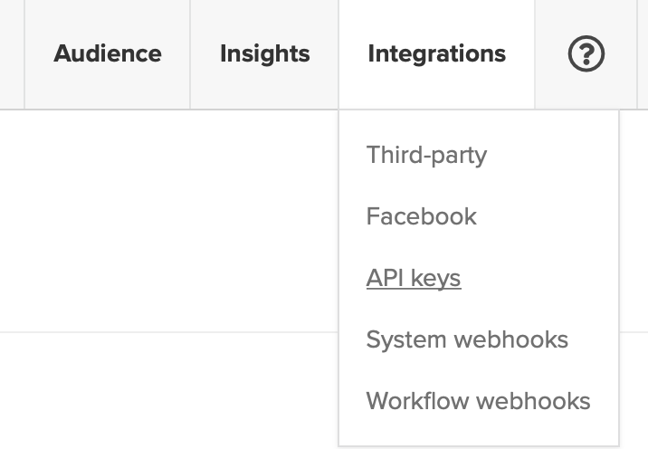
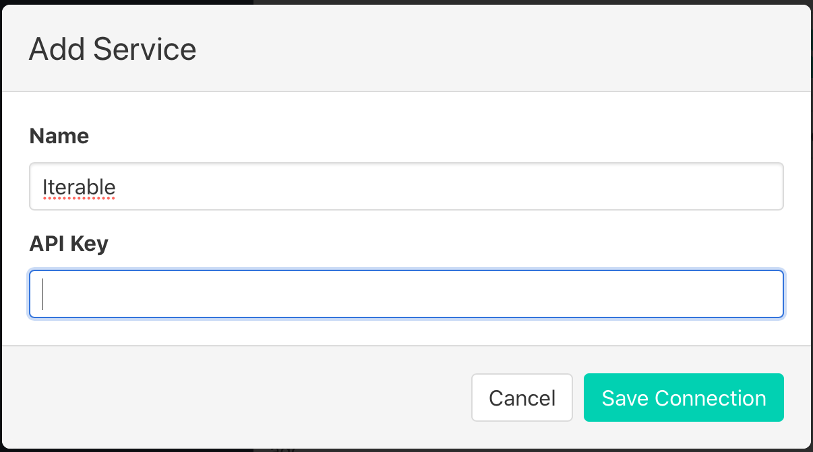

# Iterable


Please note that for larger syncs, it might take ~10 minutes for you to see the new data in Iterable's UI.


## 🏃‍♂️ Getting Started

### 1. Create a new Iterable API key

To connect Census to your Iterable, you'll need to provide Census with an API key so that we can talk to it directly. 

**A. Go to your Integration &gt; API keys page**

In the top right, click on your name, and select Account Settings



**B. Create a new key for Census**

Click the Create New API key button in the top left.


Select the "Standard" key type from the subsequent dropdown. 


Copy the resulting key \(a string of 32 characters\) to add it to Census.

**C. Create a new Iterable connection in Census**

* Visit the Connections tab in Census
* Then select Iterable from the Add Service menu
* Finally, paste in the API Key you just created. You can customize the name of the connection if you plan to connect multiple instances of Iterable.



Iterable will now appear as a new destination for Census syncs. 

### 2. Syncing data into Iterable

Once the service is added, you can sync users from your database into your Iterable audience \(and augment existing contacts with new product data\).

When creating a sync in Census, you can use _email_ or _userId_ as an identifier. 


You can map data fields into your existing Iterable audience schema \(including into nested schemas\). You can also create new custom fields by clicking "+ Add Custom Field" when editing the mapping.



**Nested Objects in Iterable**

Iterable supports nested objects and fields on its User object. If you would like to send JSON, Arrays, or JSON Arrays to a field in Iterable, you may.

For most data warehouses, there are specific datatypes for these types of values. However, Amazon Redshift does not natively support JSON, so you will want to store this type of data as a string value. Provided that the values are valid JSON, Census will ensure that it is nested as expected when sending the data to Iterable. 

As an example, valid JSON for a field named "subscription" could have the following value:

```text
{
  "plan": "Premium",
  "products": [
      "unlimited_users",
      "24_hr_support_sla"
    ]
}
```

We recommend testing your JSON fields in Redshift by using Redshift's [IS\_VALID\_JSON](https://docs.amazonaws.cn/en_us/redshift/latest/dg/IS_VALID_JSON.html) and [IS\_VALID\_JSON\_ARRAY](https://docs.amazonaws.cn/en_us/redshift/latest/dg/IS_VALID_JSON_ARRAY.html) functions, especially before creating new fields in Iterable via Census's field mapper.


