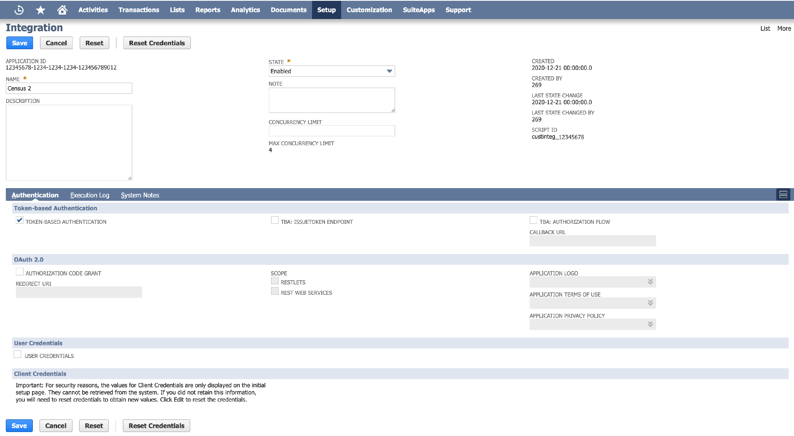
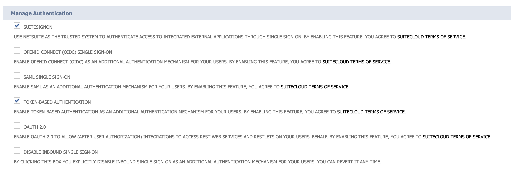
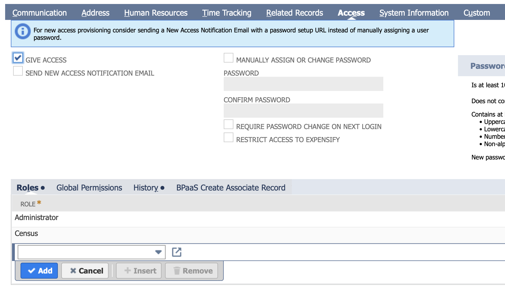
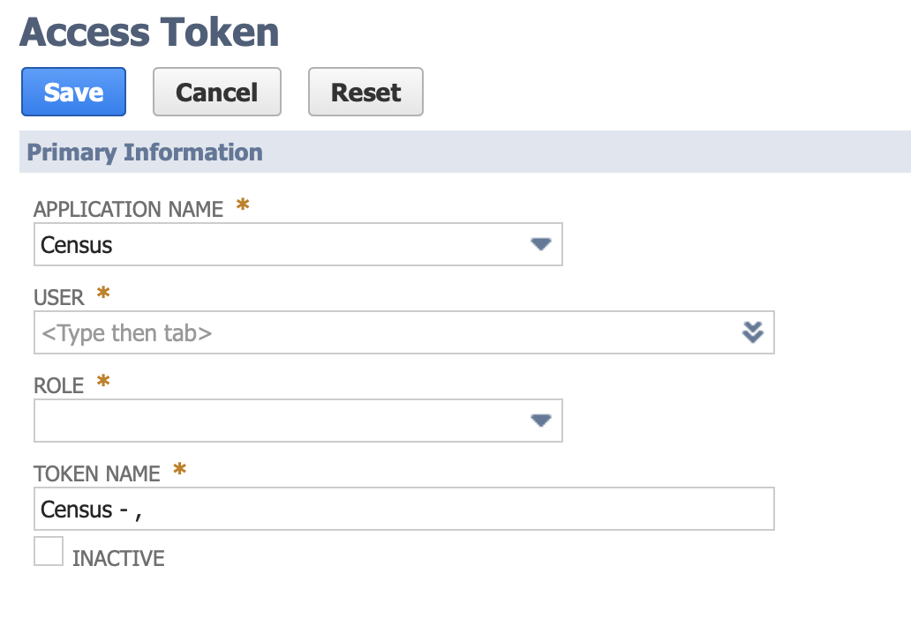

# NetSuite

## 🏃‍♀️ Getting Started



In addition to may other destinations, Census can sync your data warehouse data into NetSuite objects such as Customer, Invoice, and more. In this article, we'll walk you through the process of setting up a new NetSuite connection in Census.

### 0. Prerequisites

You'll need a Census account as well as a NetSuite account with the Administrator role. This process involves several steps - please set aside 15-30 minutes to complete it. NetSuite configuration can be complex, so if you have any questions please reach out to support@getcensus.com and we'll help you tailor these instructions to your needs.

### 1. Create an Integration Record for Census

1. Visit the integrations page or use the global search to look for and navigate to: **page: Manage Integrations**

1. Create a new integration with the follow properties:
   * Give it a name that you'll recognize, such as **Census**
   * **Check** TOKEN-BASED AUTHENTICATION
   * Leave OAuth 2.0 AUTHORIZATION CODE GRANT **unchecked**
   * Leave TBA: AUTHORIZATION FLOW **unchecked**
   * Set State to **Enabled**
2. Click Save when finished.
3. Copy and paste the **CONSUMER KEY / CLIENT ID** and **CONSUMER SECRET / CLIENT SECRET** to a password manager. You'll need those later to paste into Census.

### 2. Enable Token Based Authentication

1. Global search to **page: Enable Features**
2. Navigate to the tab **SuiteCloud &gt; Manage Authentication**
3. Make sure **Token Based Authentication is checked**
4. Save

### 3. Create a Token Role

The Administrator user you're using with NetSuite and Census also needs "Token Role".

1. Global search to **page: New Role**
2. Name the role: **Census**
3. Check **WEB SERVICES ONLY ROLE**
4. Check **DO NOT RESTRICT EMPLOYEE FIELDS**
5. For multi-subsidiary NetSuite users**,** check **ALL** under **ACCESSIBLE SUBSIDIARIES**
6. Under **Permissions &gt; Setup**, add the following permissions:
   * Access Token Management: **Full**
   * Custom Body Fields: **Full**
   * Custom Column Fields: **Full**
   * Custom Entity Fields: **Full**
   * Custom Fields: **Full**
   * Custom Item Fields: **Full**
   * SOAP Web Services: **Full**
   * User Access Token: **Full**

7. Under  **Permissions &gt; Lists**, Give your Role the appropriate permissions for the NetSuite objects you'll be updating. For example, to update Customers, you'll want to give this role the Lists &gt; Customers \(Full\) permission.

### 4. Add Token Management Permissions

1. Global search to **page: Employees**
2. Edit the employee record of the Admin user you will be using Census with.
3. Navigate to **Access &gt; Roles** and add the Token Role you just created above.

### 5. Create Access Tokens

1. Global search to **page: Access Tokens**
2. Click **New Access Token**
3. Select the application and role we created above, then press Save
4. Copy and paste the new Token ID and Token Secret to your password manager or file. We'll use it below.

> **Note:** Netsuite permission changes to a role or user **do not occur immediately**. These changes typically take anywhere from a few minutes to a few hours, and they can even take up to 24 hours to go into effect. If you are confident that you have given Census the correct permissions above and experience an error setting up the connection, we recommend waiting for these changes to go into effect before testing the connection again.

### **6. One more thing:** NetSuite **Account ID**

The last bit of information you’ll need is your NetSuite Account ID:

1. Global search to **page: Company Information.** 
2. Your **ACCOUNT ID** will be found on that page. Copy and paste it as well.

### 7. Finally, Configure Your Census Connection

1. Now in Census, add a new Service Connection.

1. Paste the Account ID of your NetSuite Account, as well as the Consumer Key, Consumer Secret, Token ID and Token Secret created above.

1. Click Save Connection, and click Test to double check your connection information.

You're ready to start using Census to load data from your warehouse to NetSuite! If you have any trouble with these steps, please don't hesitate to reach out to: support@getcensus.com and we'll help get this setup.

>

## 🏎 Sync Speed

NetSuite's API speed and rate limitation are complex and are tied to the plan you are on but you can expect a speed of ~500 records sync / minute on their base plan,

| **Service** | **Records sync / Minute** |
| :--- | :--- |
| NetSuite | 500 |


Please note that you can contact your Customer Success Manager at NetSuite to increase your NetSuite[ account API concurrency](https://nlcorp.app.netsuite.com/core/media/media.nl?id=127925362&c=NLCORP&h=8742ad8b887aa6881f85&_xt=.pdf) to increase the records sync speed.


## 🗄️ Supported Objects

This is is the current list of NetSuite[ objects](https://www.netsuite.com/portal/developers/resources/suitetalk-documentation.shtml) supported by our connector. There are many more and we add them on a case by case basis. If you need a different type of object, please contact us to let us know which object do you need, and we will be happy to support it.

| **Object Name** | **Supported?** |
| ---: | :---: |
| Account | ✅ |
| Cash Sale | ✅ |
| Class | ✅ |
| Contact | ✅ |
| Credit Memo | ✅ |
| Currency | ✅ |
| Customer | ✅ |
| Customer Status | ✅ |
| Department | ✅ |
| Employee | ✅ |
| Invoice | ✅ |
| Journal Entry | ✅ |
| Location | ✅ |
| Partner | ✅ |
| Purchase Order | ✅ |
| Sales Order | ✅ |
| Subsidiary | ✅ |
| Vendor | ✅ |


Please note that NetSuite doesn't support the [creation of fields](../basics/core-concept.md#field-creation) via Census and currently we don't support [add all fields ](../basics/core-concept.md#add-all-fields)feature for NetSuite


## 🔄 Supported Sync Behaviors


Learn more about all of our sync behaviors on our [Core Concept page](../basics/core-concept.md#the-different-sync-behaviors).


| **Behaviors** | **Supported?** | **Objects?** |
| ---: | :---: | :---: |
| **Update or Create** | ✅ | All |
| **Update Only** | ✅ | All |

🔋[Contact us](mailto:support@getcensus.com) if you want Census to support more Sync Behaviors for this destination

## 🚑 Need help connecting to NetSuite?

Contact us via support@getcensus.com or start a conversion via the [in-app](https://app.getcensus.com) chat.

