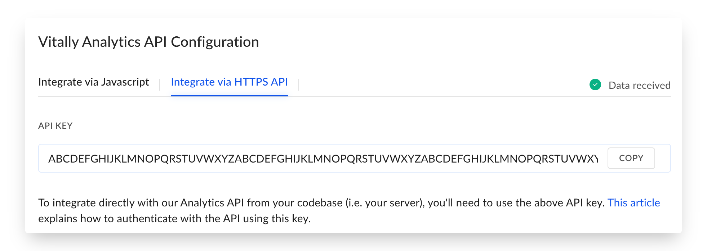

# Vitally

## 🏃‍♀️ Getting Started

In this guide, we will show you how to connect Vitally to Census and create your first sync.

### Prerequisites

* Have your Census account ready. If you need one, [create a Free Trial Census account](https://app.getcensus.com/) now.
* Have your Vitally account ready.
* Have the proper credentials to access to your data source. See our docs for each supported data source for further information:
  * [Databricks](https://docs.getcensus.com/sources/databricks)
  * [Google BigQuery](https://docs.getcensus.com/sources/google-bigquery)
  * [Google Sheets](https://docs.getcensus.com/sources/google-sheets)
  * [Postgres](https://docs.getcensus.com/sources/postgres)
  * [Redshift](https://docs.getcensus.com/sources/redshift)
  * [Rockset](https://docs.getcensus.com/sources/rockset)
  * [Snowflake](https://docs.getcensus.com/sources/snowflake)

### 1. Copy your Vitally API Key

Census uses your Vitally API key to send data. Before we can connect Census to Vitally, we need to first copy that key out of Vitally's settings page.

1. Click the ⚙️ icon at the bottom of the left sidebar, select **Integrations**, and then **Vitally Analytics API**. Or navigate directly to `https://[your-domain].vitally.io/integrations/api`
2. Select **Integrate via HTTPS API**
3. Copy the key out of the **API Key** box

### 2. Connect Vitally

* Once you are in Census, Navigate to [Connections](https://app.getcensus.com/connections)
* Click the **Add Service** button
* Select **Vitally** in the list
* Paste your API Key into the **API Token** field
* Optionally name your new connection and then click **Save**

## 🗄 Supported Objects

| **Object Name** | **Supported?** | **Matching Keys** | **Create Fields** |
| --------------: | :------------: | :---------------: | :---------------: |
|           Users |        ✅       |    User ID only   |         ✅         |
|        Accounts |        ✅       |  Account ID only  |         ✅         |
|   "Track" Event |        ✅       |      Event ID     |         ✅         |
|             NPS |       🔜       |                   |                   |

Vitally defines User ID and Account ID as the unique ID for these objects in your system. You are free to use whatever ID you like, but it needs to be unique.&#x20;

### User Behavior Notes

* Users must have at least one Account in Vitally so **Accounts** is a required field when syncing to users. It's also an Array field so it you'll need to provide it an array value or JSON formatted Array.
* Any Account ID values used when mapping to  that don't already exist in Vitally will be automatically created.

## 🔄 Supported Sync Behaviors


Learn more about all of our sync behaviors on our [Core Concept page](../basics/core-concept/#the-different-sync-behaviors).


|        **Behaviors** | **Supported?** | **Objects** |
| -------------------: | :------------: | :---------: |
| **Update or Create** |        ✅       |     All     |
|      **Update Only** |       🔜       |     All     |

Contact us if you want Census to support more Sync Behaviors for Vitally

## 🔍 Additional Service Quirks

* Vitally's internal database has a delay between Census completing its upload and having those results reflected in the UI. This delay can be a couple seconds to a couple minutes in extreme cases.
* As with all Census syncs, when you unmap a field in Census, we will stop updating those fields. We do not delete them.

## 🚑 Need help connecting to Vitally?

[Contact us](mailto:support@getcensus.com) via support@getcensus.com or start a conversation with us via the [in-app](https://app.getcensus.com) chat.
