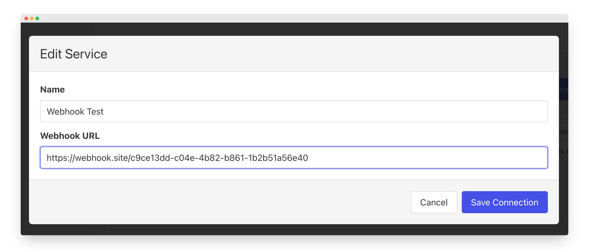
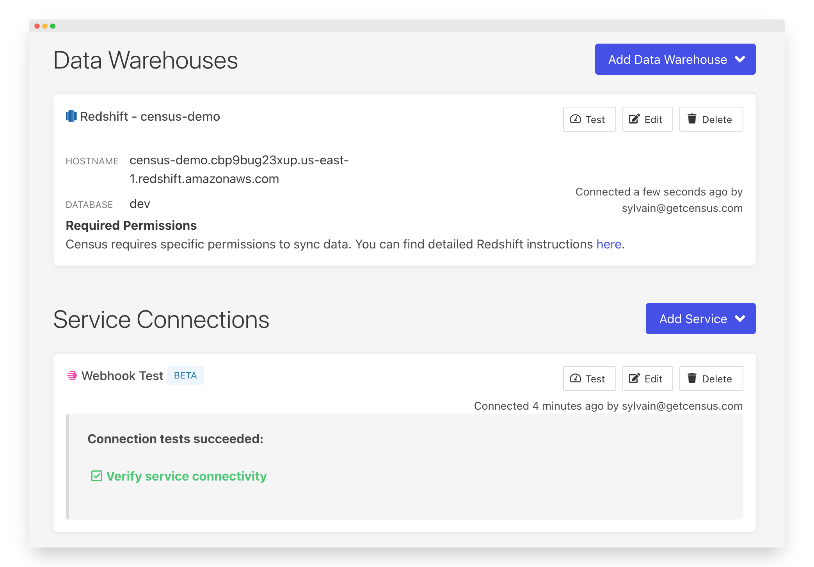
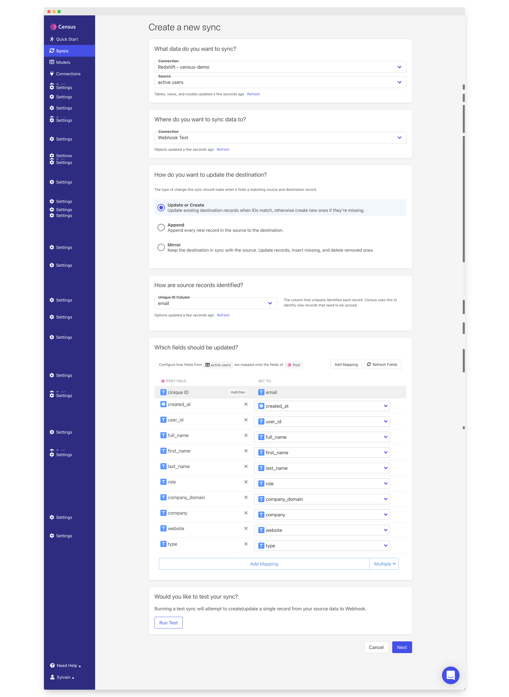
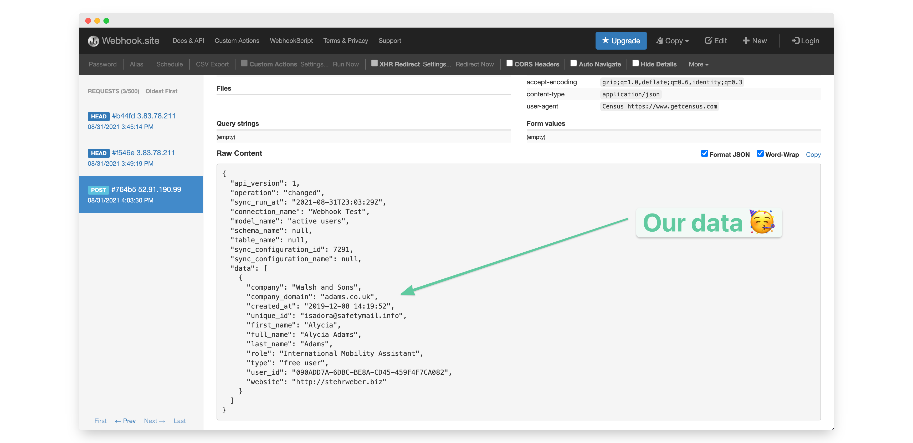

# Webhooks

## 🏃‍♀️ Getting Started

In this guide, we will show you how to connect webhooks to Census and create your first sync.

### Prerequisites

* Have your Census account ready. If you need one, [create a Free Trial Census account](https://app.getcensus.com/) now.
* Have an endpoint that accepts `POST` requests ready. You can use the free service [https://webhook.site](https://webhook.site/c9ce13dd-c04e-4b82-b861-1b2b51a56e40) for testing purposes. Please note that we use a HEAD request to test the Webhook connection so make sure you're able to accept this as well.&#x20;
* Have the proper credentials to access to your data source. See our docs for each supported data source for further information:
  * [Databricks](https://docs.getcensus.com/sources/databricks)
  * [Google BigQuery](https://docs.getcensus.com/sources/google-bigquery)
  * [Google Sheets](https://docs.getcensus.com/sources/google-sheets)
  * [Postgres](https://docs.getcensus.com/sources/postgres)
  * [Redshift](https://docs.getcensus.com/sources/redshift)
  * [Rockset](https://docs.getcensus.com/sources/rockset)
  * [Snowflake](https://docs.getcensus.com/sources/snowflake)

### 1. Create a Webhook Destination in Census

* Once you are in Census, Navigate to [Connections](https://app.getcensus.com/connections)
* Click the **Add Service** button
* Select **Webhook** in the dropdown list
* Name your Destination (for example, `webhooksite test`) and Input the URL of your endpoint  👇




Your webhook destination will automatically be tested as we send a`HEAD`request and waiting for a`200 OK`to confirm it works.


### 2. Connect your Data Warehouse

Please follow one of our short guides depending on your data warehouse technology:

* [Redshift](https://help.getcensus.com/article/10-configuring-redshift-postgresql-access)
* [Postgres](https://help.getcensus.com/article/10-configuring-redshift-postgresql-access)
* [BigQuery](https://help.getcensus.com/article/21-configuring-bigquery-access)
* [Snowflake](https://help.getcensus.com/article/8-configuring-snowflake-access)

After setting up your warehouse, your Census Connections Page should look like this



### 3. Create your first Model

Now navigate to the [Model section of our Dashboard](https://app.getcensus.com/models)

Here you will have to write SQL queries to select the data you want to send to your Webhook Endpoint. Here are some ideas of data you can send:

* List of users that have their trial expired
* Accounts that have reached a specific Lead scoring
* list of users who haven't finished their product onboarding

Once you have created your model, click save.&#x20;


### 4. Create your first Sync

Now head to the [Sync page](https://app.getcensus.com/syncs) and click the **Add Sync** button

In the " **What data do you want to sync?"** section

* For the **Connection**, select the data warehouse you connected in step 2
* For the **Source,**  select the model you created in step 3

Next up is the **"Where do you want to sync data to?"** section

* Pick your Webhook destination (for us it is `Webhook Test`) as **the Connection**
* ⚠️ If you are familiar with Census, you will notice that there is no Object to select.

For the " **How should changes to the source be synced?"** section&#x20;

* Select **Update or Create**
* Pick a **unique ID.** this is the key we will use to make sure we only sync new records or records with new values. We recommend using an internal id and if not, email/domain.

Finally, select the fields you want to update in the Mapper in the **"Which Fields should be updated?"** section

* By default, all of your table columns will be added to the mapper. If you don't want that, simply remove the columns/fields you don't want to sync in the mapper.

The end result should look something like this:




If you want, to can test the sync at the bottom which will sync one record to your destination


Click the **Next** button to see the final preview which will have a recap of what will happen when you start the sync

### 5. Confirm the data was sent to your Webhook Endpoint

Now go back to your destination or service, in our case we will go to [https://webhook.site](https://webhook.site/c9ce13dd-c04e-4b82-b861-1b2b51a56e40) and we should see a JSON payload will all of our data 🎉



That's it, in 5 steps, you connected Census to any endpoints or services by using webhooks 🎉

## 🏎 Sync Speed

Webhook destination speeds are subject to any rate limit enforced by the endpoint you are sending data to.

## 🗄 Webhook Schema

Each webhook `POST` contains both the data you mapped as well as metadata about the Census sync itself. The JSON schema of our request is as follows:

```javascript
{
  "api_version": 1,
  "operation": "changed",
  "sync_run_at": "2021-08-31T23:03:29Z",
  "connection_name": "Webhook Test",
  "model_name": "active users",
  "schema_name": null,
  "table_name": null,
  "sync_configuration_id": 1234,
  "sync_configuration_name": null,
  "data": [
  // This is an object representing the fields
  //  you mapped for that sync
    {
      "company": "Walsh and Sons",
      "company_domain": "adams.co.uk",
      "created_at": "2019-12-08 14:19:52",
      "unique_id": "isadora@safetymail.info",
      "first_name": "Alycia",
      "full_name": "Alycia Adams",
      "last_name": "Adams",
      "role": "International Mobility Assistant",
      "type": "free user",
      "user_id": "090ADD7A-6DBC-BE8A-CD45-459F4F7CA082",
      "website": "http://stehrweber.biz"
    }
  ]
}
```

## 🔄 Supported Sync Behaviors


Learn more about what all of our sync behaviors on our [Core Concept page](../basics/core-concept/#the-different-sync-behaviors).


|        **Behaviors** | **Supported?** | **Objects?** |
| -------------------: | :------------: | :----------: |
| **Update or Create** |        ✅       |      All     |
|           **Append** |        ✅       |      All     |
|           **Mirror** |        ✅       |      All     |

[Contact us](mailto:support@getcensus.com) if you want Census to support more sync behaviors for webhooks.

## 🚑 Need help connecting to Webhooks?

[Contact us](mailto:support@getcensus.com) via support@getcensus.com or start a conversation with us via the [in-app](https://app.getcensus.com) chat.
