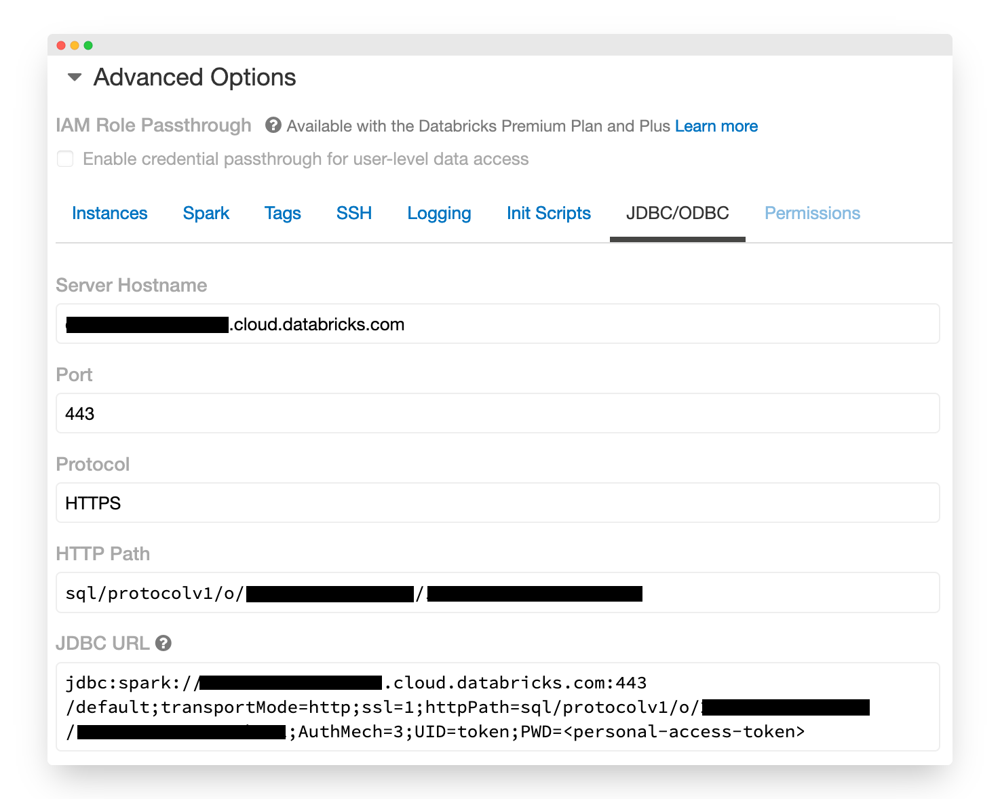
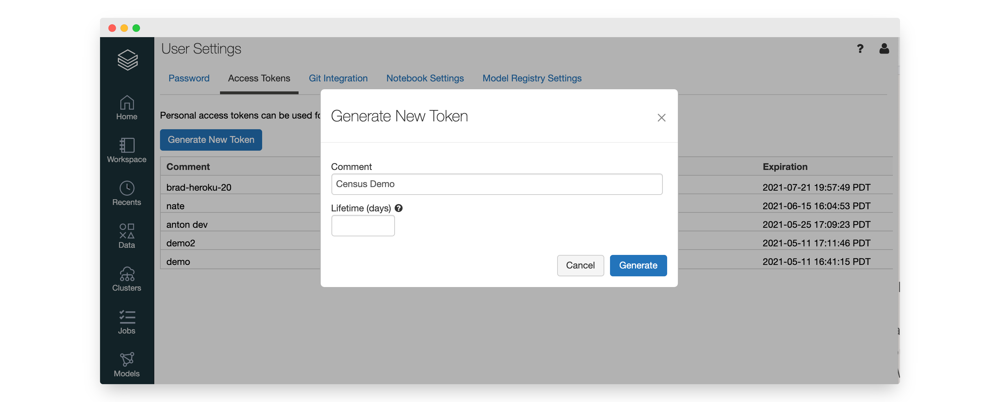
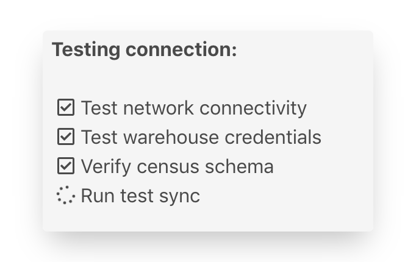

# Databricks

## Configuring a new Databricks connection


Census supports Databricks LTS versions: 7.3, 9.1, and 10.4





1\. Visit the **Connections** section on Census, and press **Add Data Warehouse Connection**, selecting **Databricks** from the list.

2\. Enter the **hostname, port, and HTTP Path** for your cluster. These can be found in the Databricks UI under **Clusters** → **\[Your Cluster]** → **Advanced Options** \_\_ → \_\_ **JDBC/ODBC.** The [Databricks documentation](https://docs.databricks.com/integrations/bi/jdbc-odbc-bi.html#workspace-cluster) covers this in more detail.



3\. Enter your Databricks **Access Token.** A token can be generated in the\
👤→ **User Settings** page in the Databricks UI.



4\. Add the following configuration parameters to your cluster. This can be done under **Clusters** → **\[Your Cluster]** → **Advanced Options** _→_ **Spark.**

```
spark.hadoop.fs.s3n.impl.disable.cache true
spark.hadoop.fs.s3.impl.disable.cache true
spark.hadoop.fs.s3a.impl.disable.cache true
```

5\. If the CENSUS schema has not been created, please create it by running the following:

```
CREATE SCHEMA IF NOT EXISTS CENSUS;
```

6\. After the connection is saved, go ahead and press the **Test** button. This will validate that you've completed the above steps correctly. Once you've got a checkmark for all four steps, you're good to go!



## 🚑 Need help connecting to Databricks?

[Contact us](mailto:support@getcensus.com) via support@getcensus.com or start a conversation with us via the [in-app](https://app.getcensus.com) chat.
